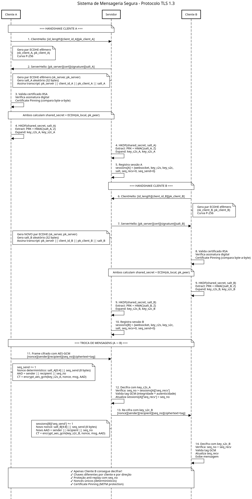

# Sistema de Mensageria Segura

**Trabalho de Segurança**  
**UFC Campus Quixadá - Prof. Michel Sales Bonfim**

Sistema de mensageria multicliente com protocolo de segurança baseado em conceitos do TLS 1.3, utilizando **WebSockets** para comunicação.

---

## Sobre o Projeto

Sistema de mensagens seguras onde múltiplos clientes se conectam a um servidor central e trocam mensagens criptografadas. O projeto foi atualizado para suportar conexões via **WebSockets**, facilitando o uso com túneis HTTP (como ngrok).

### Garantias de Segurança
- **Confidencialidade**: AES-128-GCM (AEAD).
- **Integridade**: Tag de autenticação GCM.
- **Autenticidade**:
  - Assinatura Digital RSA-PSS (Transcript: `pk_S || client_id || pk_C || salt`).
  - **Certificate Pinning**: O cliente valida se o certificado do servidor corresponde ao arquivo local.
- **Forward Secrecy**: ECDHE (Curva SECP256R1), chaves efêmeras por sessão.
- **Anti-Replay**: Contadores de sequência monotônicos.
- **Rotação de Chaves**: Chaves renovadas automaticamente a cada 1000 mensagens (HKDF Ratchet).

### Funcionalidades Extras
- **Validação de ID**: Proteção contra IDs malformados.
- **Comando `/users`**: Listagem de usuários online.
- **Suporte a Ngrok**: Conexão simples via internet através de túneis HTTP/TCP.

---

## Pré-requisitos

### Python 3.8+ e Dependências

Instale as bibliotecas necessárias:
```bash
pip install -r requirements.txt
```
*(Requer `cryptography` e `websockets`)*

---

## Como Rodar a Aplicação

#### Passo 1: Gerar Certificado do Servidor

**Obrigatório.** Gera as chaves RSA e o certificado usado para autenticação e pinning.

```bash
python3 generate_certs.py
```
**Arquivos gerados:** `server.key` (Chave Privada) e `server.crt` (Certificado Público).

#### Passo 2: Iniciar o Servidor

```bash
python3 server.py --host 127.0.0.1 --port 8888
```
*Argumentos opcionais: `--host` e `--port`.*

#### Passo 3: Conectar Clientes

**Importante**: O arquivo `server.crt` deve estar na mesma pasta onde o `client.py` for executado.

**Localmente:**
```bash
python3 client.py alice
```

**Via Ngrok (Internet):**
1. Inicie o ngrok: `ngrok tcp 8888`
2. Copie o endereço (ex: `0.tcp.ngrok.io:12345`).
3. No cliente remoto (com o `server.crt` copiado):
   ```bash
   python3 client.py bob --host 0.tcp.ngrok.io --port 12345
   ```

### Passo 4: Troca de Mensagens

No terminal do cliente, digite:
```
destinatario:mensagem
```
Exemplo: `bob:Olá, tudo bem?`

Comandos especiais:
- `/users`: Lista quem está online.
- `sair`: Encerra a conexão.

---

## Estrutura do Projeto

```
secure-messaging/
├── requirements.txt     # Bibliotecas utilizadas 
├── crypto_utils.py      # Primitivas criptográficas (ECDHE, RSA, HKDF, AES-GCM)
├── generate_certs.py    # Gerador de certificado RSA
├── server.py            # Servidor WebSocket 
└── client.py            # Cliente WebSocket Interativo         
```

---

## Fluxo do Protocolo (Visão Geral)



---

## Equipe

**Integrantes:**
- Luis Felipe Morais de Lima - 538605 
- Paulo Vitor Pinheiro da Silva - 542156 
- Wania Kelly dos Santos Oliveira - 540491 
